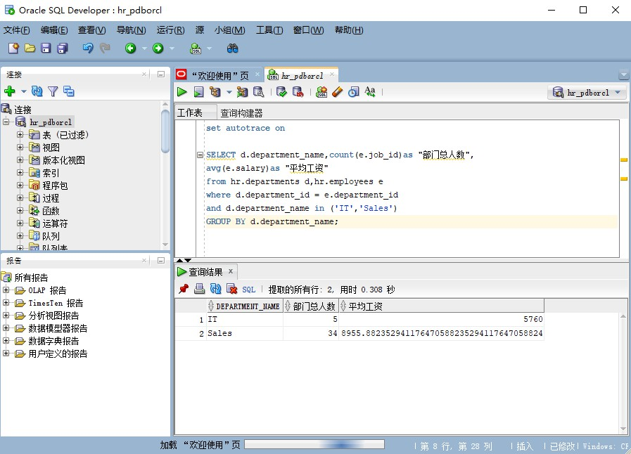
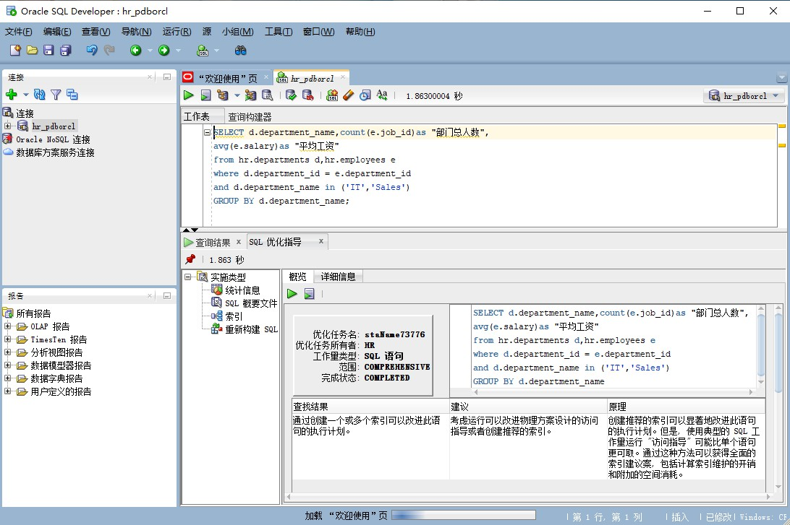
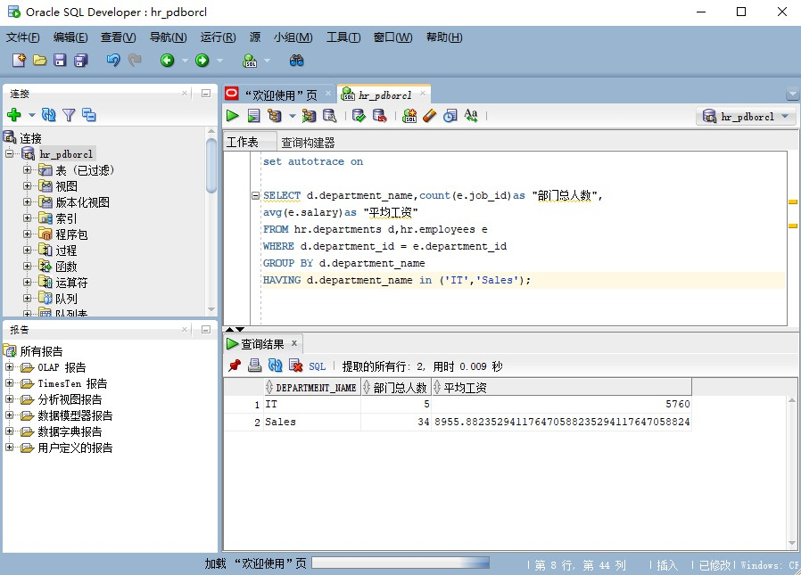
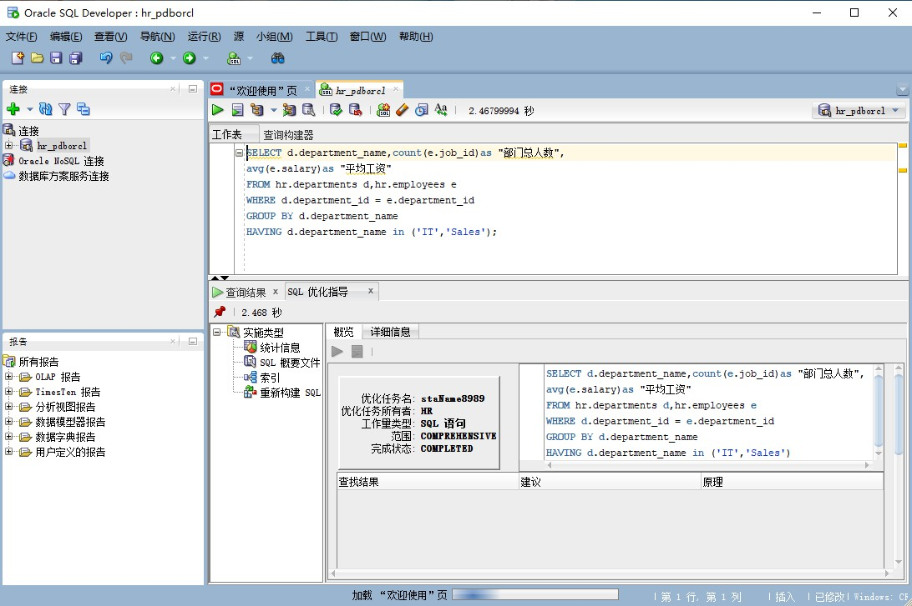
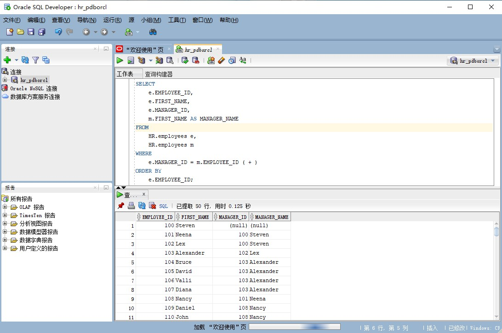
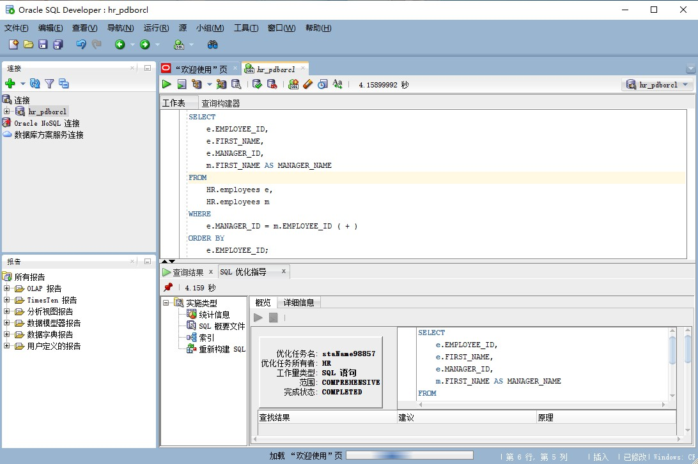
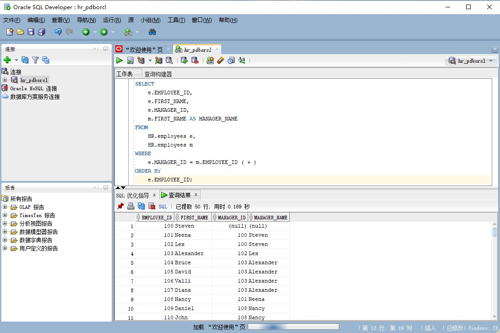
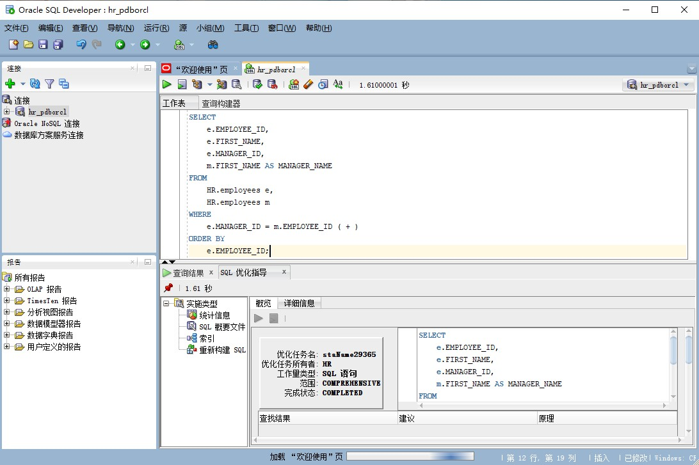

***姓名：杨辰露
学号：201810414105
班级：18软工1班***

# 实验1：SQL语句的执行计划分析与优化指导
## 实验目的：
    1. 分析SQL执行计划，执行SQL语句的优化指导。
    2. 理解分析SQL语句的执行计划的重要作用。
## 实验内容：
- 对Oracle12c中的HR人力资源管理系统中的表进行查询与分析。
- 首先运行和分析教材中的样例：本训练任务目的是查询两个部门('IT'和'Sales')的部门总人数和平均工资，以下两个查询的结果是一样的。但效率不相同。
- 设计自己的查询语句，并作相应的分析，查询语句不能太简单。
## 查询1：
```sql
    set autotrace on
    SELECT d.department_name,count(e.job_id)as "部门总人数",
    avg(e.salary)as "平均工资"
    from hr.departments d,hr.employees e
    where d.department_id = e.department_id
    and d.department_name in ('IT','Sales')
    GROUP BY d.department_name;
```

## 结果：


## 执行优化指导



## 查询2：
```sql
    set autotrace on
    SELECT d.department_name,count(e.job_id)as "部门总人数",
    avg(e.salary)as "平均工资"
    FROM hr.departments d,hr.employees e
    WHERE d.department_id = e.department_id
    GROUP BY d.department_name
    HAVING d.department_name in ('IT','Sales');
```
## 结果：


## 执行优化指导


### 结论

* 由上述代码可知,查询1是在索引范围内查询,共扫描了10行，查询2是在全表范围内查询,共扫描了107行，可知查询1的时间成本远小于查询2，因此我们可以得出结论:查询1更优。
* 在执行优化指导后发现，查询1有优化建议，查询2无优化建议。

## 自己设计的查询语句：

### 语句1：
```sql
SELECT
    e.EMPLOYEE_ID,
	e.FIRST_NAME,
	e.MANAGER_ID,
	( SELECT M.FIRST_NAME FROM HR.employees m WHERE m.EMPLOYEE_ID = e.MANAGER_ID ) AS MANAGER_NAME 
FROM
	HR.employees e 
ORDER BY
	e.EMPLOYEE_ID;
```


### 查询结果


### 执行优化指导：


### 语句2：

```sql
SELECT
	e.EMPLOYEE_ID,
	e.FIRST_NAME,
	e.MANAGER_ID,
	m.FIRST_NAME AS MANAGER_NAME 
FROM
	HR.employees e,
	HR.employees m 
WHERE
	e.MANAGER_ID = m.EMPLOYEE_ID ( + ) 
ORDER BY
	e.EMPLOYEE_ID;
```


### 查询结果：

### 执行优化指导：


### 结论
由上述两种查询方式的查询结果以及执行优化指导所得结果可知，语句1付出的成本小于语句2,因此语句1优于语句2。此外,由代码可知,由于语句2使用了子查询作为一个字段的属性，使得每一次输出之后都要再次查询一次表,时间成本更大。