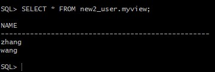

***姓名：杨辰露
学号：201810414105
班级：18软工1班***

### 新角色--------con_res_view_ycl  
### 新用户--------new_user_ycl

# 实验2：用户及权限管理
## 实验目的：
    掌握用户管理、角色管理、权根维护与分配的能力，掌握用户之间共享对象的操作技能。
## 实验内容：
Oracle有一个开发者角色resource，可以创建表、过程、触发器等对象，但是不能创建视图。本训练要求：
- 在pdborcl插接式数据中创建一个新的本地角色con_res_view_ycl，该角色包含connect和resource角色，同时也包含CREATE VIEW权限，这样任何拥有con_res_view_ycl的用户就同时拥有这三种权限。
- 创建角色之后，再创建用户new_user_ycl，给用户分配表空间，设置限额为50M，授予con_res_view_ycl角色。
- 最后测试：用新用户new_user_ycl连接数据库、创建表，插入数据，创建视图，查询表和视图的数据。
## 实验步骤：
- 第1步：以system登录到pdborcl，创建角色con_res_view_ycl和用户new_user_ycl，并授权和分配空间：
```sql
    $  sqlplus system/123@202.115.82.8/czm
    SQL> CREATE ROLE con_res_view_ycl;
    角色已创建。
    SQL> GRANT connect,resource,CREATE VIEW TO con_res_view_ycl;
    授权成功。
    SQL> CREATE USER new_user_ycl IDENTIFIED BY 123 DEFAULT TABLESPACE users TEMPORARY TABLESPACE temp;
    用户已创建。
    SQL> ALTER USER new_user_ycl QUOTA 50M ON users;
    用户已更改。
    SQL> GRANT con_res_view_ycl TO new_user_ycl;
    授权成功。
    SQL> exit
```

- 第2步：新用户new_user_ycl连接到pdborcl，创建表mytable_ycl和视图myview_ycl，插入数据，最后将myview_ycl的SELECT对象权限授予hr用户。
```sql
    $ sqlplus system/123@202.115.82.8/czm
    SQL> show user;
    USER 为 "NEW_USER"
    SQL> CREATE TABLE mytable_ycl (id number,name varchar(50));
    表已创建。
    SQL> INSERT INTO mytable_ycl(id,name)VALUES(1,'zhang');
    已创建 1 行。
    SQL> INSERT INTO mytable_ycl(id,name)VALUES (2,'wang');
    已创建 1 行。
    SQL> CREATE VIEW myview_ycl AS SELECT name FROM mytable_ycl;
    视图已创建。
    SQL> SELECT * FROM myview_ycl;
    NAME
    --------------------------------------------------
    zhang
    wang
    SQL> GRANT SELECT ON myview_ycl TO hr;
    授权成功。
    SQL>exit
```

- 第3步：用户hr连接到pdborcl，查询new_user授予它的视图myview_ycl
```sql
    $ sqlplus system/123@202.115.82.8/czm
    SQL> SELECT * FROM new_user.myview;
    NAME
    --------------------------------------------------
    zhang
    wang
    SQL> exit
```

- 测试用户之间的表的共享
```sql
$ sqlplus system/123@202.115.82.8/czm
    SQL> SELECT * FROM new_user.myview;
    NAME
    --------------------------------------------------
    zhang
    wang
    SQL> exit
```

## 查看数据库的使用情况

```sql
$ sqlplus system/123@202.115.82.8/czm

SQL>SELECT tablespace_name,FILE_NAME,BYTES/1024/1024 MB,MAXBYTES/1024/1024 MAX_MB,autoextensible FROM dba_data_files  WHERE  tablespace_name='USERS';

SQL>SELECT a.tablespace_name "表空间名",Total/1024/1024 "大小MB",
 free/1024/1024 "剩余MB",( total - free )/1024/1024 "使用MB",
 Round(( total - free )/ total,4)* 100 "使用率%"
 from (SELECT tablespace_name,Sum(bytes)free
        FROM   dba_free_space group  BY tablespace_name)a,
       (SELECT tablespace_name,Sum(bytes)total FROM dba_data_files
        group  BY tablespace_name)b
 where  a.tablespace_name = b.tablespace_name;
```

### 结论

* 在本次Oracle实验中,我们学习了用户管理、角色管理、权根维护与分配，并且掌握用户之间共享对象的操作技能。
* Orale权限分为系统权限和对象权限。系统权限是指在系统级控制数据库的存取和使用机制,对象权限是对象的所有者授予其他用户操作该对象的某种权利。
* 本次实验中,由于pdborcl数据库中包含了所有同学新建的角色和用户,所有同学的用户都使用表空间users存储表的数据,所以表空间中存储了很多相同名称的表mytable和视图myview。不过其分别属性于不同的用户，不会引起混淆。
* 但是随着往表中插入的数据增加，表空间的磁盘使用量也会随之增加。
