# 基于Oracle的点餐系统数据库设计
在互联网经济飞速发展的时代，网络化企业管理也在其带领下快速兴起，开发一款自主点餐系统会受到众多商家的青睐。现如今市场上的人力资源价格是非常高昂的，一款自主点餐系统可以减少餐厅的人力开销，将服务员从繁忙的点餐过程中解脱出来，将厨师从重复制菜的烦恼中解脱出来，并减少了高峰期用餐时点餐出错的几率，同时减少了餐厅定期更新印制菜单的开销，提高了餐厅的档次和品位.
## 1.设计表空间使用方案
创建表空间YCL1，大小为150M
```sql
Create Tablespace YCL1
datafile 'D:\studyData\oracle\oracleData\YCL1_1.dbf'
  SIZE 150M AUTOEXTEND ON NEXT 256M MAXSIZE UNLIMITED,
'D:\studyData\oracle\oracleData\YCL1_2.dbf'
  SIZE 150M AUTOEXTEND ON NEXT 256M MAXSIZE UNLIMITED
EXTENT MANAGEMENT LOCAL SEGMENT SPACE MANAGEMENT AUTO;
```
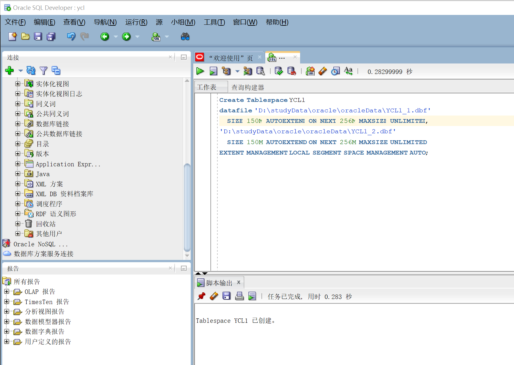

创建表空间YCL2，大小也为150M

```sql
Create Tablespace YCL2
datafile 'D:\studyData\oracle\oracleData\YCL2_1.dbf'
  SIZE 150M AUTOEXTEND ON NEXT 256M MAXSIZE UNLIMITED,
'D:\studyData\oracle\oracleData\YCL2_2.dbf'
  SIZE 150M AUTOEXTEND ON NEXT 256M MAXSIZE UNLIMITED
EXTENT MANAGEMENT LOCAL SEGMENT SPACE MANAGEMENT AUTO;
```
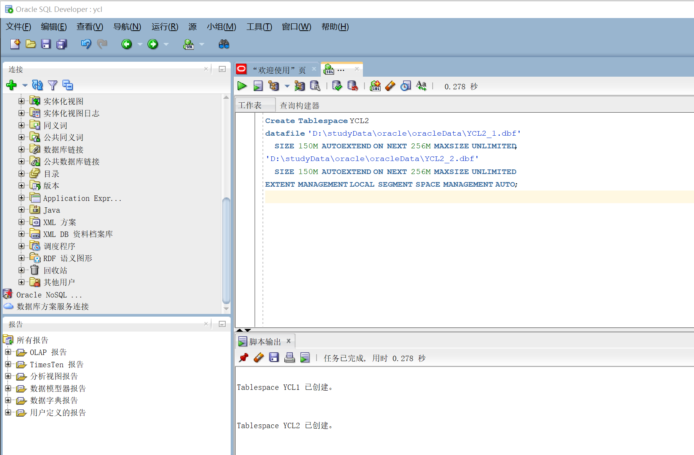
查看：
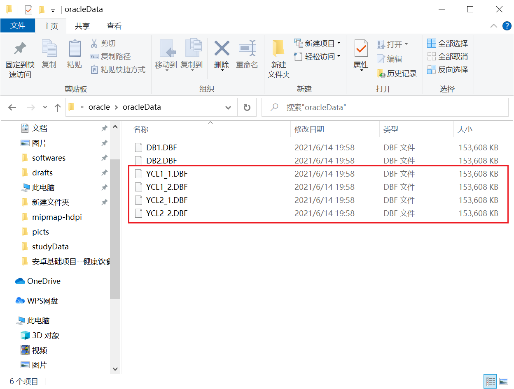
## 2.设计权限及用户分配方案
创建角色role1，并将create view,connect,resource权限授予role1；再创建用户char1，将角色qhl1授权给用户qhl_1
```sql
-- 创建角色role1
create role role1;
-- 将create view,connect,resource权限授予role1
grant create view,connect,resource to myrole;
-- 创建用户char1（默认使用表空间YCL1）
create user char1 IDENTIFIED BY 666 DEFAULT TABLESPACE YCL1 TEMPORARY TABLESPACE temp;
-- 分配70M空间给char1
ALTER USER char1 QUOTA 70M ON YCL1;
-- 并将角色qhl1授权给用户qhl_1
GRANT role1 TO char1;
```
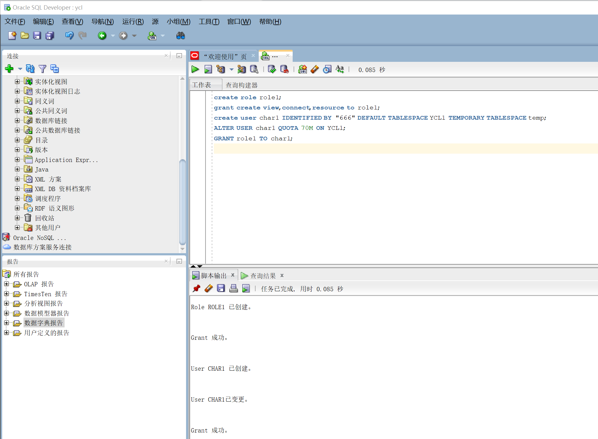
```sql
-- 创建角色role2
create role role2;
-- 将connect,resource权限授予role2
grant connect,resource to role2;
-- 创建用户char2（默认使用表空间YCL1）
create user char2 IDENTIFIED BY 666 DEFAULT TABLESPACE YCL1 TEMPORARY TABLESPACE temp;
-- 分配70M空间给char2
ALTER USER char2 QUOTA 70M ON YCL1;
-- 并将角色role2授权给用户char2
GRANT role2 TO char2;
```
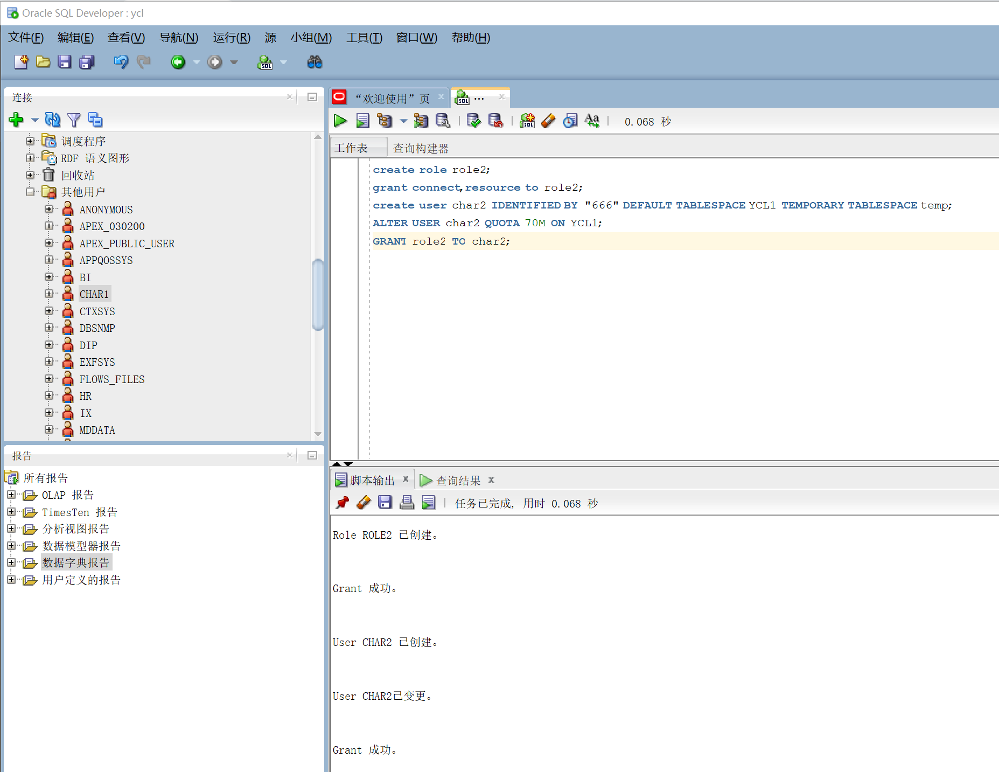
查看已经创建的用户
```sql
select *from dba_user;
```
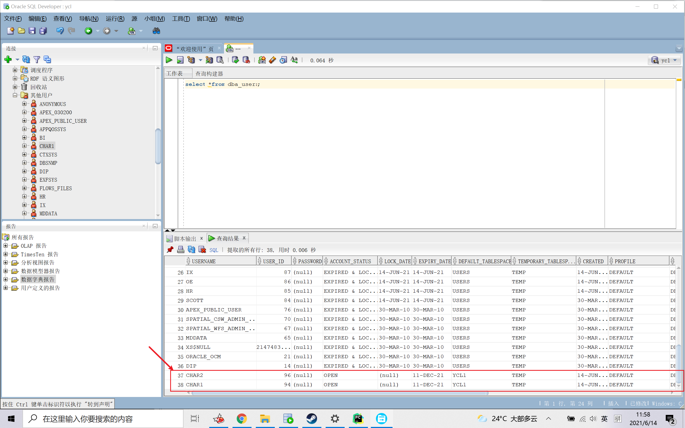
## 3.设计表
### 3.1设计用户表
```sql
create table user (
  user_id number(6, 0) not null,
  name varchar2(40 byte) not null,
  password varchar2(20 byte) not null
  address varchar2(30 byte) not null
  phone number(11,0),
  email varchar2(40 byte),
  constraint user_pk primary key (userid)
  using index (
      create unique index admin_pk on admin (userid asc) --在表上创建一个简单的索引
      logging
      tablespace YCL1
      pctfree 10 -- 保留10%空间给更新该块数据使用
      initrans 2 -- 初始化事物槽的个数
      storage-- storage 存储参数 指定表数据存储在哪个缓冲池中(默认oracle
      (
        buffer_pool default
      )
      noparallel
  )
  enable
)
logging
tablespace YCL1
pctfree 10
initrans 1
storage (
  buffer_pool default
)
nocompress
no inmemory
noparallel;
```
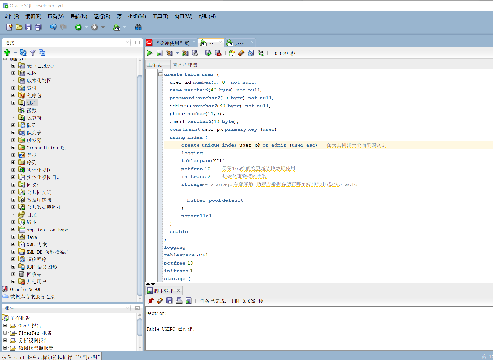

### 3.2设计管理员表
```sql
create table admin (
  id number(*, 0) NOT NULL
, password varchar2(20 BYTE) not null
, adminname varchar2(20 BYTE) not null
, CONSTRAINT admin_pk PRIMARY KEY (id)
  USING INDEX (
      create unique index admin_pk on admin (id asc) --在表上创建一个简单的索引
      logging
      tablespace YCL1
      pctfree 10 -- 保留10%空间给更新该块数据使用
      initrans 2 -- 初始化事物槽的个数
      storage-- storage 存储参数 指定表数据存储在哪个缓冲池中(默认oracle
      ( 
        buffer_pool default
      )
      noparallel
  )
  enable
) 
logging
tablespace YCL1
pctfree 10 
initrans 1 
storage (
  buffer_pool default 
)
nocompress
no inmemory
noparallel;
```
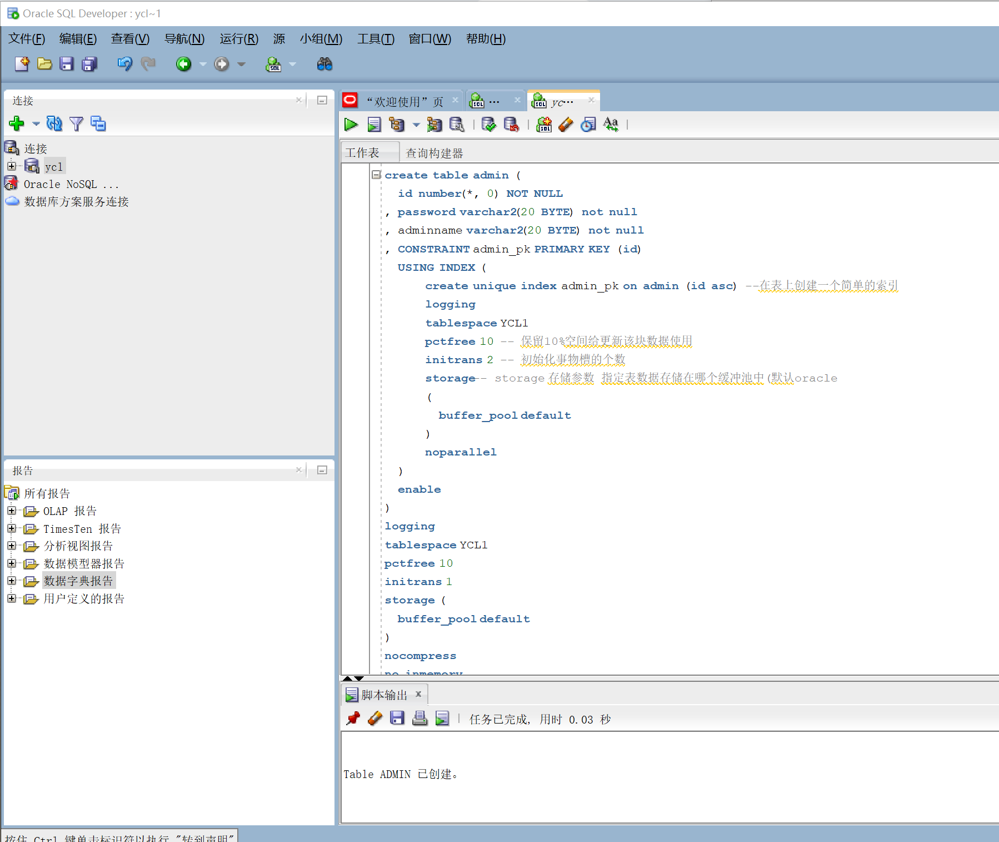
### 3.3设计订单表
```sql
create table order (
  id number(6, 0) primary key,
  order_id number(6, 0) not null,
  order_name varchar2(40 byte) not null,
  order_date date,
  order_discount number(8.2),
  order_totalprice number(8.2),
  using index (
      create unique index admin_pk on admin (order_id asc) --在表上创建一个简单的索引
      logging
      tablespace YCL1
      pctfree 10 -- 保留10%空间给更新该块数据使用
      initrans 2 -- 初始化事物槽的个数
      storage-- storage 存储参数 指定表数据存储在哪个缓冲池中(默认oracle
      (
        buffer_pool default
      )
      noparallel
  )
  enable
)
logging
tablespace YCL1
pctfree 10
initrans 1
storage (
  buffer_pool default
)
nocompress
no inmemory
noparallel;
```
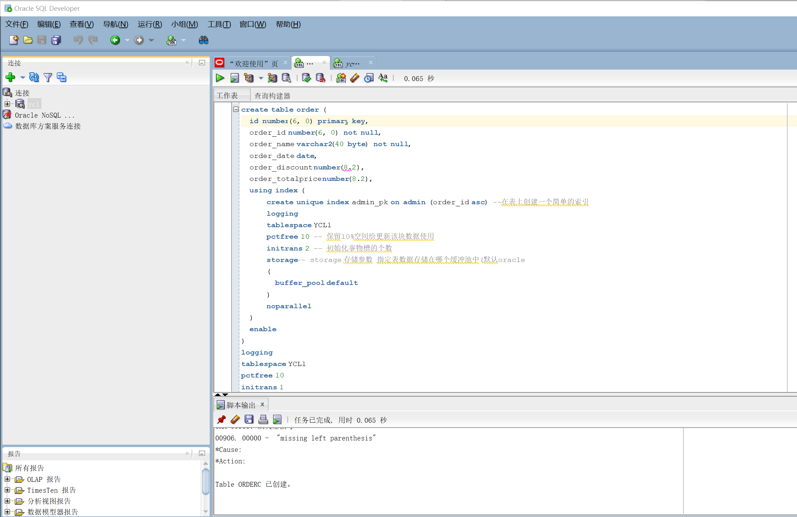
### 3.4设计菜品表
```sql
CREATE TABLE dish
(
  id number(*, 0) not null,
  dish_id number(*, 0) not null,
  dish_name varchar2(20 byte) not null,
  dish_discribe varchar2(50 byte) not null,
  dish_price number NOT NULL
  using index
  (
      create unique index dish_pk ON dish (dish_id asc)
      logging
      tablespace YCL1
      pctfree 10
      initrans 2
      storage
      ( 
        buffer_pool default
      ) 
      noparallel
  )
  enable
) 
logging
tablespace YCL1
pctfree 10
initrans 1
storage (
  buffer_pool default
)
nocompress
no inmemory
noparallel;
```
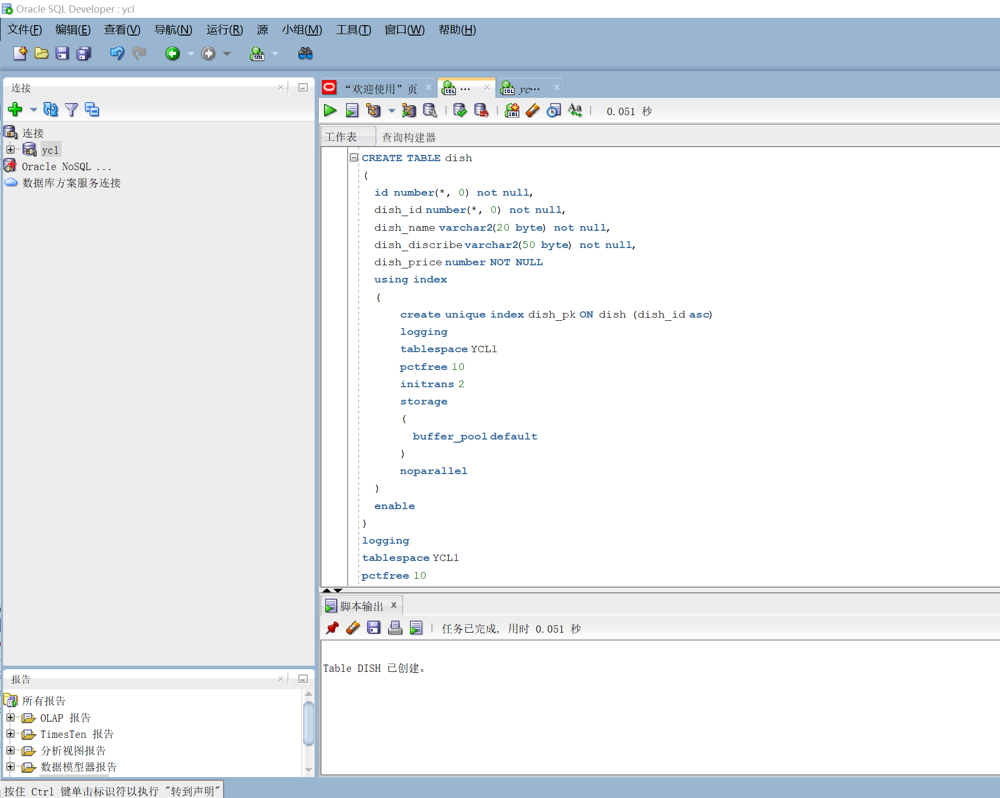
### 3.5设计店铺表
```sql
create table shop
(
  shop_id number(*, 0) primary key,
  shop_name varchar2(20 byte) not null,
  shop_discribe varchar2(50 byte) not null,
  shop_dish varchar2(100 byte)
  using index
  (
      create unique index shop_pk ON shop (shop_id asc)
      logging
      tablespace YCL1
      pctfree 10
      initrans 2
      storage
      ( 
        buffer_pool default
      ) 
      noparallel
  )
  enable
) 
logging
tablespace YCL1
pctfree 10
initrans 1
storage (
  buffer_pool default
)
nocompress
no inmemory
noparallel;
```
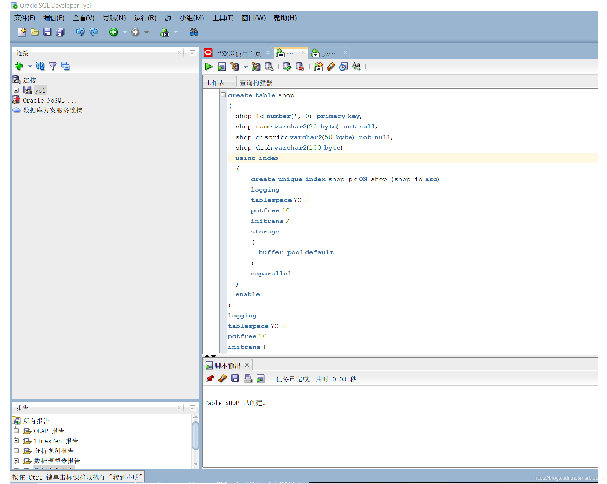
### 3.6查看已经创建好的表
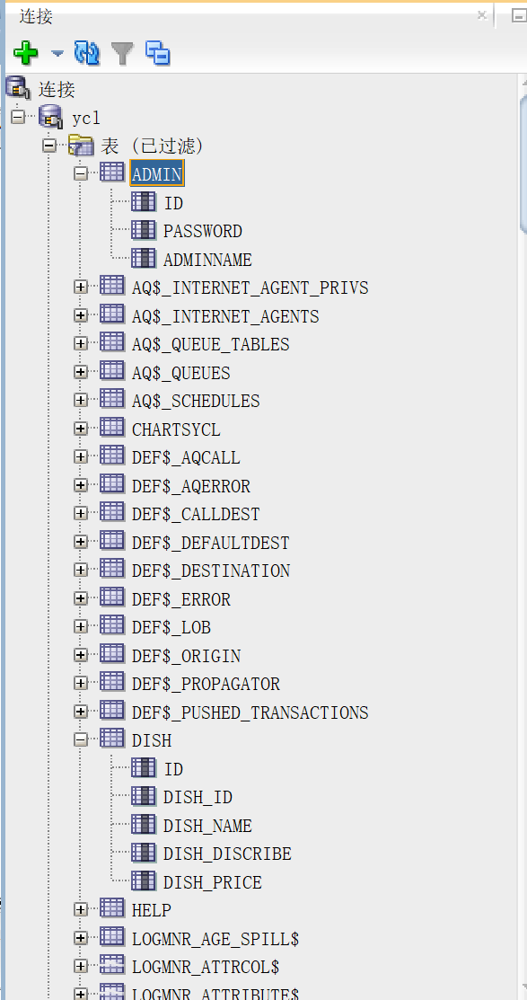
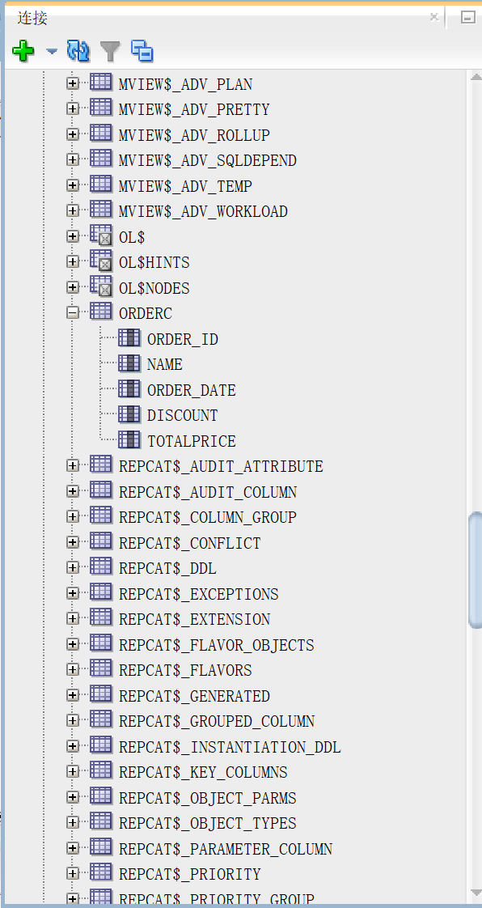
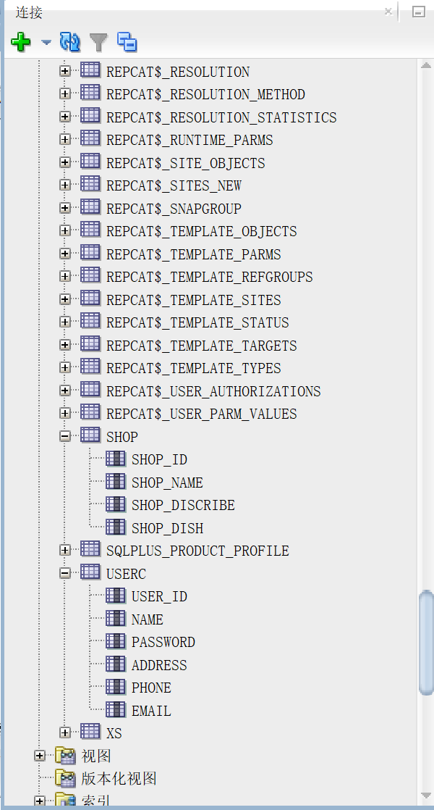
### 3.7插入用户与菜品数据
```sql
declare
  user_id number(6,0);
  name varchar2(40);
  password varchar2(20);
  address varchar2(30);
  phone varchar2(11);
  email varchar2(40);
  dish_id number(10),
  dish_name varchar2(20),
  dish_discribe varchar2(50),
  dish_price number
begin
  for i in 1..25000
  loop
    --插入用户
    user_id:=(i mod 25000);
    name := 'ycl'|| 'lcy';
    password := '666666' || '123456';
	address :='成都市龙泉驿区成都大学第10教学楼'|| '成都市龙泉驿区成都大学15栋';
    phone := '1571234567' || '1579876543';
    email := '495900000@qq.com' || '123456@163.com';
    insert into userc (user_id,name,password,address,phone,email)
      values (user_id,name,password,address,phone,email);
    --插入菜品
    dish_name :='长沙臭豆腐' || '水煮牛肉';
    dish_discribe :='长沙臭豆腐' || '水煮牛肉';
    dish_price :='20' || '25';
	insert into dish(dish_id,dish_name,dish_discribe,dish_price)
		values (i,dish_name,dish_discribe,dish_price);
  end loop;
end;
```
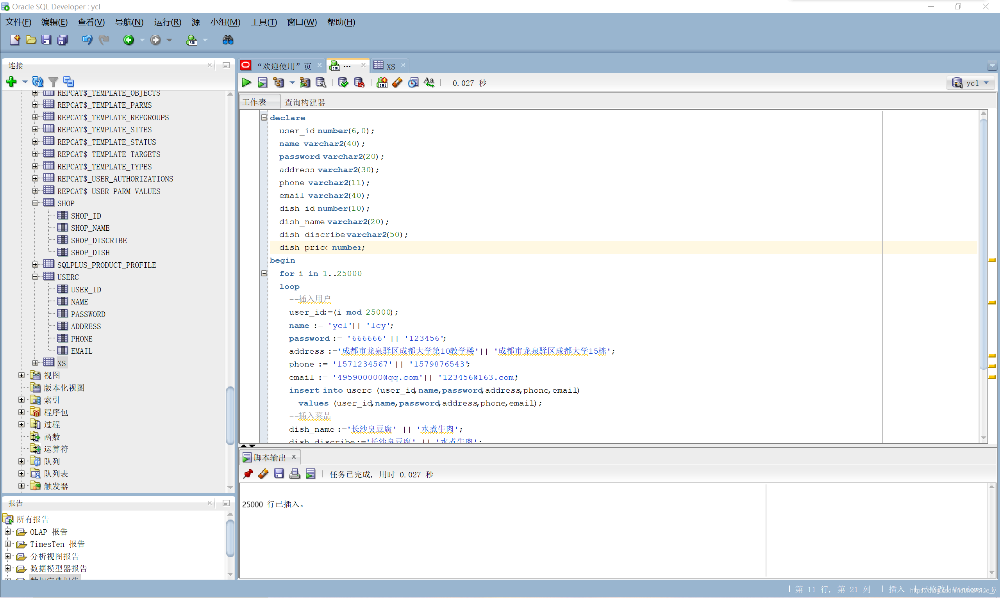
## 4.创建程序包、存储过程、函数执行分析计划
```sql
create or replace PACKAGE book_package Is
   function getaverageprice(shop_id number) return number;
   procedure adduser(user_id number,name varchar2,password varchar2,address varchar2,phone number,email varchar2);
end book_package;

create or replace PACKAGE body book_package Is
        -- 函数gettotalprice计算每个店铺的菜品均价
       function getaverageprice(shop_id number) return number as
          begin
            declare shop_average number;
			query_sql varchar2(250);
            begin
			  query_sql:='select sum(dish_price) from dish where dish_id=' || shop_dishes;
              execute immediate query_sql into shop_average;
			  return shop_average;
            end;
        end getaverageprice;
        -- 存储过程adduser插入用户信息
        procedure addUser(user_id number,name varchar2,password varchar2,address varchar2,phone number,email varchar2)
            begin
              declare user_id number;
              begin
                insert into userc values(user_id+1,name,password,address,phone,email);
                commit;
              end;
            end adduser;

    end book_package;
```
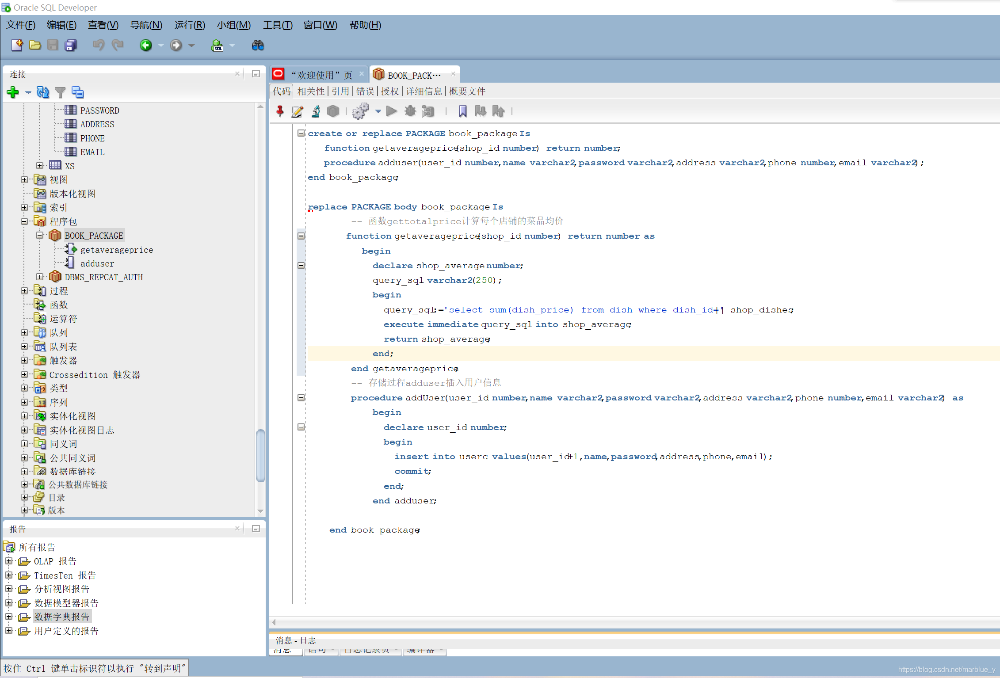
存储过程、函数执行分析
```sql
select BOOK_PACKAGE.getaverageprice(1) from shop;
```
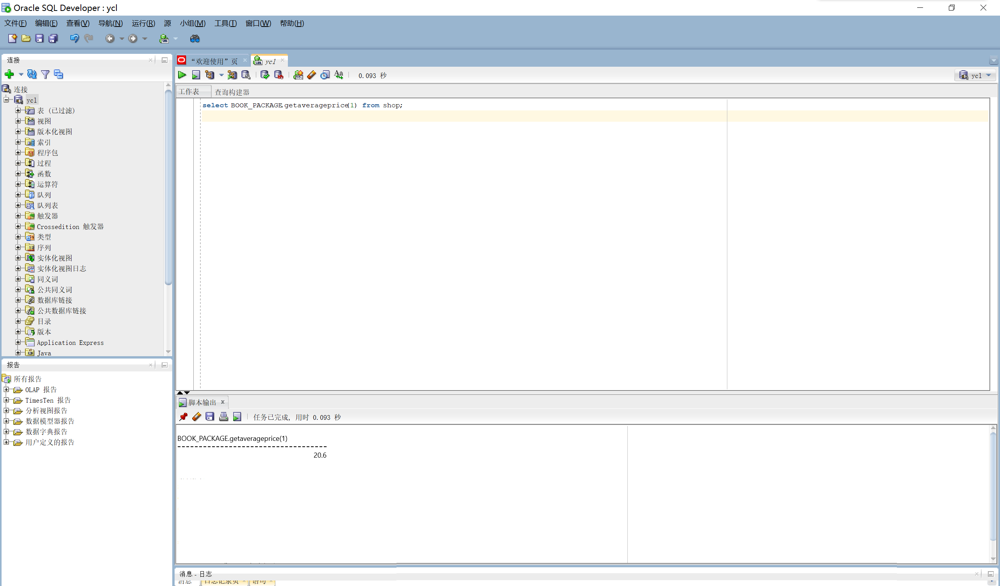
使用存储过程adduser插入用户数据
```sql
set serveroutput on
declare
begin
BOOK_PACKAGE.adduser(20,'ycl','666666','地球',110,'163.com');
end
```
## 5.设计备份方案
建立备份目录

```sql
create or replace directory dmp as 'D:\studyData\oracle\beifen'
```
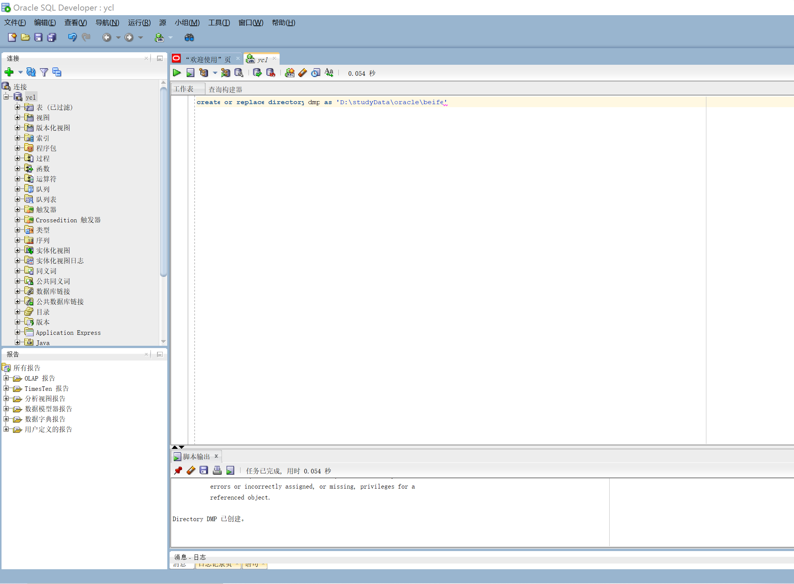
```sql
@echo off 
         set BACKUPDATE=%date:~0,4%%date:~5,2%%date:~8,2%
         set USER=system
         set PASSWORD=root
         set DATABASE=ycl
beifen'%USER%/%PASSWORD%' directory=dmp dumpfile=data_%BACKUPDATE%.dmp schemas=%DATABASE%
exit
```
执行以上批处理文件 ，将dmp文件保存到指定目录

移动批处理命令,将D:\studyData\oracle\beifen的所有文件移动到D:\studyData\oracle\oracleData下

```sql
move D:\studyData\oracle\beifen*.*  D:\studyData\oracle\oracleData 
```
删除批处理命令：
```sql
forfiles /p D:\studyData\oracle\beifen /m *.* /d -10 /c "cmd /c del @file" 
```
以Windows中的计划任务程序来触发备份脚本
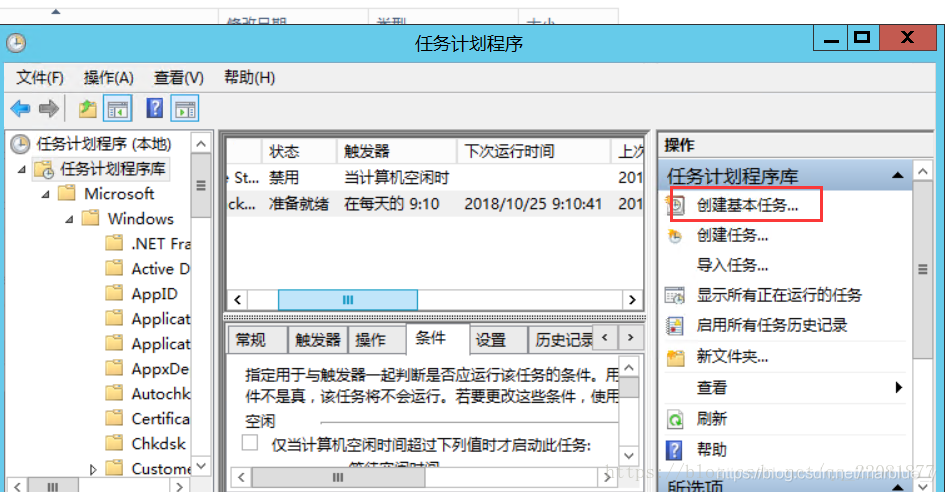